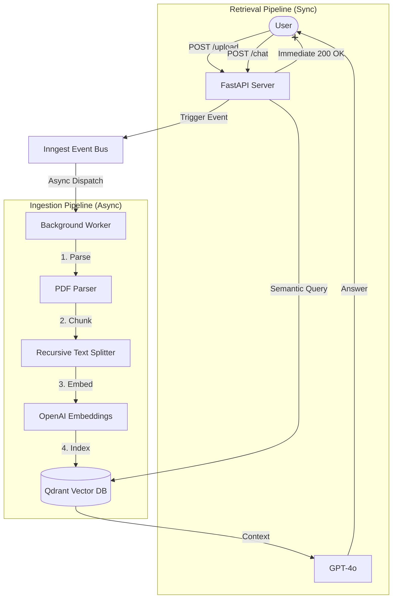

# 🚀 Asynchronous RAG Orchestration Engine


> **A high-performance, asynchronous RAG (Retrieval-Augmented Generation) pipeline designed to handle large-scale document ingestion without blocking the main application thread.**

---

## 📖 Project Overview

This system solves a common bottleneck in AI applications: **Latency during document processing.**

Instead of processing uploads synchronously (which blocks the server), this project implements an **Event-Driven Architecture**. When a user uploads a PDF, the API accepts the request immediately and offloads the heavy lifting (chunking, embedding, indexing) to a durable background queue managed by **Inngest**. This ensures the application remains responsive and scalable, even under heavy load.

---

## 🏗️ System Architecture

The system is decoupled into an **Ingestion Pipeline** (Write Path) and a **Retrieval Pipeline** (Read Path).



---

## ✨ Key Technical Features

* **⚡ Asynchronous Event Orchestration:** Utilizes **Inngest** to manage stateful background workflows. This decouples the API layer from the processing layer, allowing for horizontal scaling of workers.
* **🧠 Neural Search Engine:** Implements **Qdrant** (a dedicated Vector Database) to perform high-speed semantic similarity searches, enabling the system to "understand" context beyond simple keyword matching.
* **🛡️ Fault Tolerance & Retries:** The background pipeline includes automatic error handling. If the OpenAI API times out or rate-limits, the job is not lost; it is automatically queued for retry with exponential backoff.
* **🐳 Containerized Infrastructure:** Leverages **Docker** to run the Qdrant instance locally, simulating a production-grade microservices environment.
* **🔒 Type-Safe Backend:** Built with **FastAPI** and Pydantic for rigorous data validation and auto-generated API documentation (Swagger UI).

---

## 🛠️ Tech Stack

| Component | Technology | Description |
| :--- | :--- | :--- |
| **Backend Framework** | **FastAPI** | High-performance, async Python web framework. |
| **Orchestration** | **Inngest** | Event bus for managing background jobs and durable execution. |
| **Vector Database** | **Qdrant** | High-performance vector search engine for storing embeddings. |
| **AI/ML Models** | **OpenAI / LlamaIndex** | `gpt-4o` for generation and `text-embedding-3` for vectorization. |
| **Infrastructure** | **Docker** | Used to containerize the Vector Database. |

---

## 🚀 Getting Started

Follow these instructions to set up the project on your local machine.

### 1. Prerequisites
Ensure you have the following installed:
* **Python 3.10+**
* **Docker Desktop** (Required for the local Vector DB)
* **Node.js** (Required only for the Inngest local dashboard)

### 2. Installation

Clone the repository and install the Python dependencies.

```bash
# Clone the repository
git clone https://github.com/Kunal-Ranjan-Singh/Asynchronous_RAG_Orchestration_Engine.git
cd Asynchronous_RAG_Orchestration_Engine

# Create a virtual environment
python -m venv venv
source venv/bin/activate  # On Windows use: venv\Scripts\activate

# Install dependencies
pip install -r requirements.txt
```


## 3. Environment Config

```env
# OpenAI API Key (Required for Embeddings & Chat)
OPENAI_API_KEY="sk-..."

# Qdrant Database Config (Defaults for Local Docker)
QDRANT_URL="http://localhost:6333"
QDRANT_API_KEY=""

# Inngest Config (Defaults for Local Dev Server)
INNGEST_EVENT_KEY="local"
INNGEST_SIGNING_KEY="local"
```

---

## 4. Running the Application

To run the full system locally, you need to spin up **three separate services**.  
Run each command in a **separate terminal window**.

### Terminal 1: Start the Vector Database (Docker)

This starts the Qdrant server instance.

```bash
docker run -p 6333:6333 qdrant/qdrant
```

### Terminal 2: Start the Inngest Dev Server
This starts the dashboard to visualize your event queues.
```bash
npx inngest-cli@latest dev
```

### Terminal 3: Start the Backend API
This starts your FastAPI application.
```bash
uvicorn main:app --reload
```

---


## 🧪 How to Use
Once all terminals are running, the system is live.

### 1. Access the API Dashboard
Open your browser to: http://localhost:8000/docs
This is the Swagger UI, where you can test API endpoints directly.

### 2. Upload a Document (Async Ingestion)
Expand the POST /upload endpoint.
Upload a PDF file.
Check Terminal 2 (Inngest): You will see the event app/process_file trigger immediately. The API returns success while the background worker processes the file.

### 3. Chat with your Data
Expand the POST /chat endpoint.
Enter a query related to your uploaded PDF.
The system will retrieve the relevant vector chunks and generate a precise answer.

---

## 📄 License
This project is open-source and available under the MIT License.
